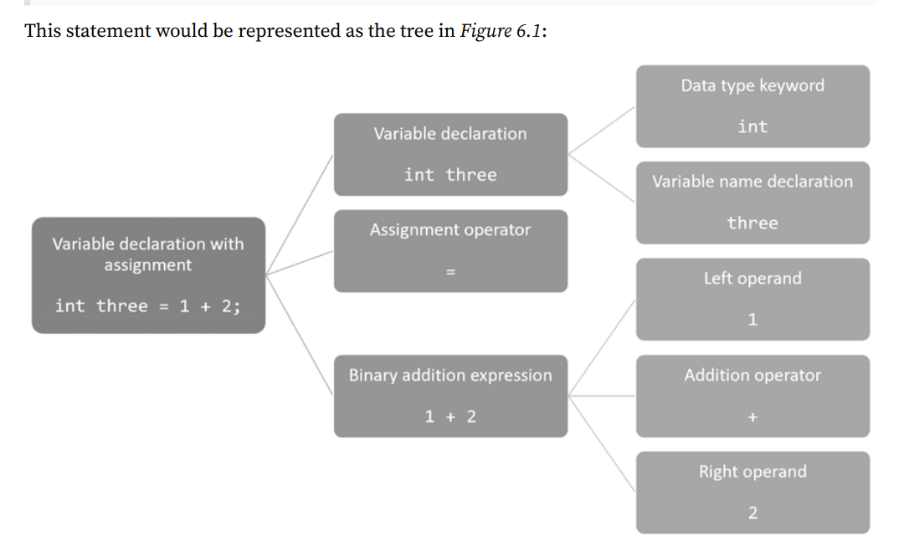

## Exercise 6.1 - Test your knowledge

1.  What are the four parts of a .NET assembly and which are optional?

    1. Assembly metadata and manifest
    2. Type metadata
    3. IL code
    4. Embedded resources (optional)

2.  What can an attribute be applied to?

    Can be applied to multiple levels: to assemblies, to types, and to their members.

3.  What are the names of the parts of a version number and what do they mean if they follow the rules of semantic versioning?

    1. MAJOR: Breaking changes.
    2. MINOR: Non-breaking changes, including new features, and often, bug fixes.
    3. PATCH: Non-breaking changes bug fixes.

    [Semver](https://semver.org/)

4.  How do you get a reference to the assembly for the currently executing console app?

    `Assembly? assembly = Assembly.GetEntryAssembly();`

5.  How do you get all the attributes applied to an assembly?

    `IEnumerable<Attribute> attributes = assembly.GetCustomAttributes();`

6.  How should you create a custom attribute?

        1. Extend from `MyClass : Attribute`
        2. Add `[AttributeUsage(AttributeTargets.Class | AttributeTargets.Method,

    AllowMultiple = true)]`    3. Use`[Coder("Kevin Santacruz", "18 Feb 1994")]`

7.  What class do you inherit from to enable dynamic loading of assemblies?

    `AssemblyLoadContext`

8.  What is an expression tree?

    Expression trees represent code as a structure that you can examine or execute. **Expression trees are immutable**.

    

9.  What is a source generator?

    Allow us to get a compilation object that represents all the code being compiled, dynamically generate additional code files, and compile those too.

10. Which interface must a source generator class implement and what methods are part of that interface?

    1. We need to implement `ISourceGenerator`
    2. Methods are: `Execute(GeneratorExecutionContext context)` and `Initialize(GeneratorInitializationContext context)`
